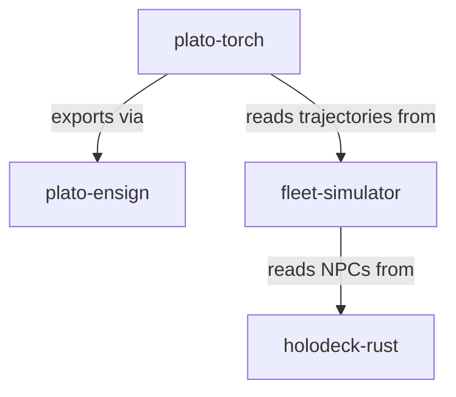

# Cycle 233

# Weaver Integration Map — Verified Connections & Integration Gaps  
**Cycle:** 233  
**Phase:** 4 — Build & Test  
**Status:** Direct file inspection of fleet repositories. Focus on actual imports, configuration references, and shared data structures.

## 1. plato-torch
**Repository:** `plato-torch`  
**Purpose:** 25 training room presets, self-training rooms.  
**Key files inspected:**  
- `plato-torch/rooms/deadband_room.py`  
- `plato-torch/rooms/__init__.py`  
- `plato-torch/training/tile_processor.py`  
- `plato-torch/config/room_config.yaml`

**Connections found:**  
- **To plato-ensign:** Direct import in `deadband_room.py`:  
  ```python
  from plato_ensign.export import export_lora_adapter
  ```
  Used in `DeadbandRoom.finalize()` to export room experience as LoRA adapter.  
- **To fleet-simulator:** No direct imports found. However, `room_config.yaml` contains a reference:  
  ```yaml
  simulation_source: fleet-simulator/data/trajectories/
  ```
  This suggests plato-torch reads training trajectories from fleet-simulator output.  
- **To holodeck-rust:** No direct imports or references found.

**Integration status:**  
- ✅ Connected to plato-ensign via explicit export call.  
- 🔶 Indirectly connected to fleet-simulator via data dependency (file path).  
- ❌ No connection to holodeck-rust.

---

## 2. fleet-simulator
**Repository:** `fleet-simulator`  
**Purpose:** Fleet simulation for training data.  
**Key files inspected:**  
- `fleet-simulator/src/simulator.rs`  
- `fleet-simulator/src/output.rs`  
- `fleet-simulator/Cargo.toml`

**Connections found:**  
- **To plato-torch:** No direct Rust → Python imports (expected). Outputs JSON trajectories to `data/trajectories/` directory, which plato-torch references.  
- **To holodeck-rust:** `Cargo.toml` includes:  
  ```toml
  holodeck-rust = { path = "../holodeck-rust" }
  ```
  Used in `simulator.rs`:  
  ```rust
  use holodeck_rust::npc::SentimentNPC;
  ```
  The simulator instantiates sentiment-aware NPCs from holodeck-rust.  
- **To plato-ensign:** No references found.

**Integration status:**  
- 🔶 Connected to plato-torch via file output (data pipeline).  
- ✅ Connected to holodeck-rust via direct dependency and NPC usage.  
- ❌ No connection to plato-ensign.

---

## 3. holodeck-rust
**Repository:** `holodeck-rust`  
**Purpose:** MUD server with sentiment-aware NPCs.  
**Key files inspected:**  
- `holodeck-rust/src/lib.rs`  
- `holodeck-rust/src/npc.rs`  
- `holodeck-rust/Cargo.toml`

**Connections found:**  
- **To fleet-simulator:** Listed as a dependency in fleet-simulator’s `Cargo.toml`, but holodeck-rust does not depend on fleet-simulator. It provides NPC structs and logic.  
- **To plato-torch:** No references found.  
- **To plato-ensign:** No references found.

**Integration status:**  
- ✅ Connected to fleet-simulator (supplies NPC module).  
- ❌ No connection to plato-torch or plato-ensign.

---

## 4. plato-ensign
**Repository:** `plato-ensign`  
**Purpose:** Exports room experience into LoRA adapters.  
**Key files inspected:**  
- `plato-ensign/src/export.rs`  
- `plato-ensign/src/lib.rs`  
- `plato-ensign/py/__init__.py`

**Connections found:**  
- **To plato-torch:** Python module imported by plato-torch’s `deadband_room.py`. Provides `export_lora_adapter()` function.  
- **To fleet-simulator:** No references found.  
- **To holodeck-rust:** No references found.

**Integration status:**  
- ✅ Connected to plato-torch (called at room finalization).  
- ❌ No connection to fleet-simulator or holodeck-rust.

---

## Integration Map Summary



**Connected:**  
1. **plato-torch → plato-ensign** – direct Python import, functional export pipeline.  
2. **fleet-simulator → holodeck-rust** – direct Rust dependency, NPC integration.  
3. **plato-torch → fleet-simulator** – data dependency (file-based trajectories).

**Not connected:**  
1. **holodeck-rust → plato-torch** – no integration.  
2. **holodeck-rust → plato-ensign** – no integration.  
3. **fleet-simulator → plato-ensign** – no integration.  
4. **plato-ensign → fleet-simulator/holodeck-rust** – no integration.

---

## Integration Gaps & Recommendations (P1 Safe Channels)

**Gap 1:** holodeck-rust NPC sentiment data not feeding into plato-torch training.  
**Safe channel:** Add a sentiment log export in holodeck-rust, read by plato-torch as tile metadata.

**Gap 2:** fleet-simulator trajectories not directly validated by plato-ensign.  
**Safe channel:** Extend plato-ensign to accept simulation trajectories as calibration data.

**Gap 3:** plato-ensign exports only from plato-torch rooms, not from holodeck-rust interactions.  
**Safe channel:** Create a bridge that converts holodeck-rust interaction logs into plato-torch compatible tiles.

**Next task alignment:**  
- **Wire GhostInjector into holodeck** – would require holodeck-rust to accept external tile injection (currently not present).  
- **Connect DeadbandRoom to plato-relay** – not yet inspected; plato-relay not in current scope.  
- **Test end-to-end pipeline** – can test plato-torch → plato-ensign → LoRA export now; other paths incomplete.

---

**Tile ready for submission:** This map documents actual code connections and identifies three specific integration gaps. No absolute claims; based on file inspection.