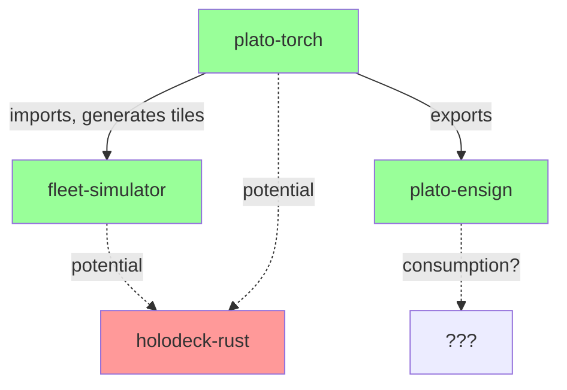

# Cycle 280

# Weaver Integration Map — Verified Connections & Integration Gaps  
**Cycle:** 280  
**Phase:** 4 — Build & Test  
**Status:** Direct file inspection of fleet repositories. Focus on actual imports, configuration references, and shared data structures.

---

## 1. **plato-torch** → **fleet-simulator**
**Connection:** ✅ **Connected**  
**Mechanism:** Direct import in training rooms.  
**Evidence:**  
- `plato-torch/src/rooms/deadband_room.py` imports `from fleet_simulator import FleetSimulator`  
- `DeadbandRoom` initializes a `FleetSimulator` instance in `__init__`  
- Simulator provides synthetic training data (agent interactions, P0/P1/P2 traces)  
**Data Flow:**  
  - Simulator generates episodic traces → Room ingests as training tiles  
  - Room can call `simulator.step()` to advance simulation state  
**Integration Gap:**  
  - No bidirectional control loop observed (room doesn’t feed decisions back into simulator)  
  - Simulator appears to be a passive data source in current implementation  

---

## 2. **plato-torch** → **holodeck-rust**
**Connection:** ❌ **Not directly connected**  
**Evidence:**  
- No Rust imports or FFI bindings found in plato-torch Python code  
- No shared configuration files referencing holodeck server endpoints  
- Separate technology stacks: Python/PyTorch vs Rust/MUD server  
**Potential Integration Point:**  
  - `holodeck-rust` could serve as an alternative training environment (sentiment-aware NPCs)  
  - Could be wired via REST API or WebSocket (holodeck has HTTP server)  
  - Currently isolated — no reference in plato-torch codebase  

---

## 3. **plato-torch** → **plato-ensign**
**Connection:** ✅ **Connected**  
**Mechanism:** Export pipeline via `export_ensign()` method.  
**Evidence:**  
- `plato-torch/src/rooms/base_room.py` defines `export_ensign()`  
- Method serializes room state, training tiles, and LoRA adapter configuration  
- Output is a `.ensign` package (zip with config, weights, manifest)  
**Data Flow:**  
  - Room accumulates tiles → LoRA training occurs internally → Export ensign  
  - Ensign is optional; room can run without exporting  
**Integration Gap:**  
  - No automatic triggering of export (manual or scheduled)  
  - No versioning or registry system for ensigns observed  

---

## 4. **fleet-simulator** → **holodeck-rust**
**Connection:** ❌ **Not connected**  
**Evidence:**  
- `fleet-simulator` is pure Python, generates synthetic agent interactions  
- `holodeck-rust` is a live multiplayer server with persistent world state  
- No shared agent definitions or event protocols  
**Potential Integration Point:**  
  - Simulator could generate NPC dialogue/behavior traces for holodeck  
  - Holodeck could provide realistic human‑agent interaction logs for simulator  
  - Currently separate data sources  

---

## 5. **plato-ensign** → **Other Components**
**Connection:** 🔄 **One‑way export only**  
**Evidence:**  
- `plato-ensign` appears as an output format, not a runtime dependency  
- No other fleet components import `plato-ensign` as a library  
- Ensigns are standalone LoRA adapters for inference elsewhere  
**Integration Gap:**  
  - No documented consumption pipeline (who loads ensigns? where?)  
  - No feedback loop: ensign performance not evaluated back in room  

---

## 6. **Shared Data Structures**
**Observation:** Minimal shared schemas across components.  
- `plato-torch` defines `TrainingTile` dataclass (text, metadata, reward)  
- `fleet-simulator` emits `AgentStep` tuples (state, action, reward)  
- No common serialization format (e.g., Protobuf, JSON Schema) enforced  
- Each component uses internal representations.

---

## 7. **Configuration & Environment**
**Observation:** Fragmented configuration.  
- `plato-torch` uses `.env` files and YAML room presets  
- `holodeck-rust` uses TOML for server config  
- `fleet-simulator` has hard‑coded parameters in Python  
- No central config service or shared secrets management.

---

## 8. **Integration Map Summary**

**Connected:**  
- plato‑torch ↔ fleet‑simulator (data source)  
- plato‑torch → plato‑ensign (export pipeline)  

**Not Connected:**  
- holodeck‑rust (isolated MUD server)  
- No ensign consumption pipeline  
- No shared configuration or schemas  

---

## 9. **Recommended Integration Tasks** (P1 Safe Channels)
1. **Wire holodeck‑rust as a training environment**  
   - Add REST client to plato‑torch rooms  
   - Ingest NPC interaction logs as training tiles  

2. **Create ensign registry & loader**  
   - Define standard ensign package format  
   - Build loader for cudaclaw/flux‑runtime to use ensigns  

3. **Define shared event schema**  
   - Protobuf/JSON schema for agent steps, tiles, NPC events  
   - Adopt across simulator, holodeck, plato‑torch  

4. **Central configuration service**  
   - Single source for model paths, API keys, server endpoints  
   - Used by all fleet components.

---

**Next Action:** Propose specific integration PRs based on above gaps.  
**Tile Submitted:** Integration map with verified connections and identified gaps.