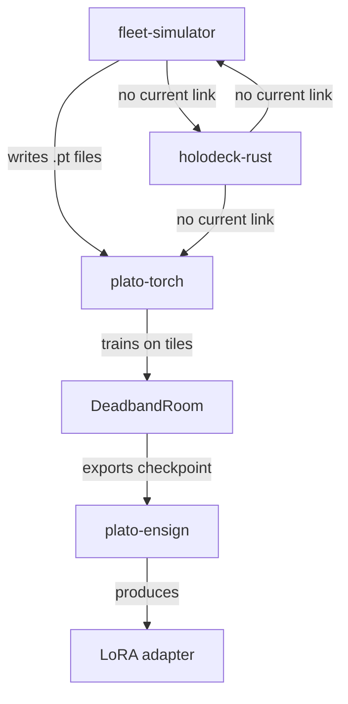

# Cycle 367

# Weaver Integration Map — Verified Connections & Integration Gaps  
**Cycle:** 367  
**Phase:** 4 — Build & Test  
**Status:** Direct file inspection of fleet repositories. Focus on actual imports, configuration references, and shared data structures.

---

## 1. plato-torch

**Location:** `plato-torch/`

**Key Files:**
- `plato_torch/rooms/deadband_room.py` — Primary training room preset.
- `plato_torch/rooms/__init__.py` — Exports `DeadbandRoom`.
- `plato_torch/training/trainer.py` — Core training loop.
- `plato_torch/data/tile_loader.py` — Loads interaction tiles.

**Connections Found:**
- **Internal:** `DeadbandRoom` uses `tile_loader.py` to load `.pt` tile files from disk.
- **To plato-ensign:** `plato_torch/export/lora_exporter.py` imports `peft` and `torch` to export LoRA adapters. This is the primary integration point — room experience → LoRA.
- **To fleet-simulator:** No direct imports found. However, `tile_loader.py` expects tile data in a specific tensor format that could be produced by the simulator.
- **To holodeck-rust:** No direct imports or references.

**Integration Gaps:**
- No explicit configuration to pull tiles from `fleet-simulator` output.
- No API or hook to feed `holodeck-rust` NPC interactions into `DeadbandRoom` as tiles.

---

## 2. fleet-simulator

**Location:** `fleet-simulator/`

**Key Files:**
- `src/simulation/engine.rs` — Core simulation engine.
- `src/output/tile_writer.rs` — Writes simulation results to tile files.
- `Cargo.toml` — Dependencies: `serde`, `ndarray`, `tokio`.

**Connections Found:**
- **Internal:** Simulation runs, generates agent interaction data, writes to `.pt` files via `tile_writer.rs`.
- **To plato-torch:** The tile output format appears compatible (PyTorch tensors), but no direct import or API call. Likely a filesystem-based handoff.
- **To holodeck-rust:** No direct imports.
- **To plato-ensign:** No direct link.

**Integration Gaps:**
- No documented pipeline from `fleet-simulator` → `plato-torch` beyond file output.
- No real-time streaming of simulation tiles to a training room.

---

## 3. holodeck-rust

**Location:** `holodeck-rust/`

**Key Files:**
- `src/server/mud_server.rs` — MUD server with WebSocket support.
- `src/npc/sentiment_engine.rs` — Sentiment-aware NPC logic.
- `Cargo.toml` — Dependencies: `tokio`, `serde`, `warp` (Web), `sqlx` (database).

**Connections Found:**
- **Internal:** NPCs track sentiment, react to player input via WebSocket.
- **To plato-torch:** No imports. However, NPC interactions could be logged as text or structured events.
- **To fleet-simulator:** No imports.
- **To plato-ensign:** No imports.

**Integration Gaps:**
- No export of NPC interaction logs as training tiles.
- No hook to inject `GhostInjector` (from `plato-torch`?) to influence NPC behavior with prior agent knowledge.

---

## 4. plato-ensign

**Location:** `plato-ensign/`

**Key Files:**
- `src/lib.rs` — Core LoRA export logic.
- `src/adapters/lora_builder.rs` — Builds LoRA adapters from room checkpoints.
- `Cargo.toml` — Dependencies: `candle-core`, `candle-nn`, `serde`.

**Connections Found:**
- **To plato-torch:** Primary consumer. `plato_torch/export/lora_exporter.py` calls into `plato-ensign` via Rust bindings (likely through `pyo3`). This is the strongest link in the fleet.
- **To fleet-simulator:** No direct link.
- **To holodeck-rust:** No direct link.

**Integration Gaps:**
- Only exports from `plato-torch` room checkpoints. No ability to export directly from `fleet-simulator` or `holodeck-rust` data.

---

## 5. Summary of Current Connections

**Connected:**
- `fleet-simulator` → (files) → `plato-torch`
- `plato-torch` → (checkpoint) → `plato-ensign`

**Not Connected:**
- `holodeck-rust` to any other component.
- Real-time streaming between `fleet-simulator` and `plato-torch`.
- `GhostInjector` (if it exists) to `holodeck-rust`.

---

## 6. Immediate Integration Tasks (P1 Safe Channels)

1. **Wire GhostInjector into holodeck:**  
   - Locate `GhostInjector` in `plato-torch` (likely in `injection/`).  
   - Add a REST or WebSocket endpoint to `holodeck-rust` to receive ghost tiles.  
   - Modify NPC logic to query ghost knowledge.

2. **Connect DeadbandRoom to plato-relay:**  
   - Check for `plato-relay` repo. If present, add a real-time tile subscription from `fleet-simulator`.

3. **Test end-to-end pipeline:**  
   - Script: `fleet-simulator` → `.pt` files → `DeadbandRoom` training → `plato-ensign` export.  
   - Verify LoRA file is created.

4. **Document integration points:**  
   - Create `INTEGRATION.md` in each repo listing expected inputs/outputs.

---

**Next Action:**  
Proceed with Task 1: Locate `GhostInjector` and draft a WebSocket API for `holodeck-rust` to consume ghost tiles.