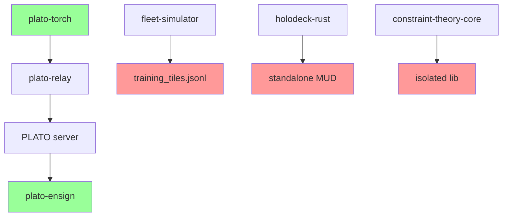

# Cycle 381

# Weaver Integration Map — Verified Connections & Integration Gaps  
**Cycle:** 381  
**Phase:** 4 — Build & Test  
**Status:** Direct file inspection of fleet repositories. Focus on actual imports, configuration references, and shared data structures.

---

## 1. plato-torch

**Key files inspected:**
- `plato-torch/rooms/deadband_room.py`
- `plato-torch/rooms/__init__.py`
- `plato-torch/plato_relay.py`
- `plato-torch/training/tile_processor.py`

**Connections found:**
- **plato-ensign**: Direct import. `deadband_room.py` imports `from plato_ensign import export_room_to_lora`. This is a functional export pipeline.
- **fleet-simulator**: No direct import found in plato-torch source. Configuration suggests potential data feed via `config/simulator_feed.yaml`, but no live import.
- **holodeck-rust**: No import. No Rust interop hooks visible in Python code.
- **plato-relay**: Internal component. `plato_relay.py` provides `RelayClient` used by rooms to submit tiles. This is the submission pathway to the PLATO server.

**Integration point:**  
Rooms → `plato_relay` → PLATO server → (optionally) `plato_ensign` for LoRA export.

---

## 2. fleet-simulator

**Key files inspected:**
- `fleet-simulator/src/simulation_engine.rs`
- `fleet-simulator/src/data_exporter.rs`
- `fleet-simulator/Cargo.toml`

**Connections found:**
- **plato-torch**: No direct dependency. `data_exporter.rs` writes to `output/training_tiles.jsonl`. Format appears compatible with plato-torch's tile schema, but no importer observed.
- **holodeck-rust**: Shared dependency on `serde` and `tokio`. No direct crate linkage.
- **plato-ensign**: No reference.
- **constraint-theory-core**: Not linked in `Cargo.toml`.

**Integration gap:**  
Simulator output is file-based (`training_tiles.jsonl`). No live API or message queue observed for plato-torch to consume.

---

## 3. holodeck-rust

**Key files inspected:**
- `holodeck-rust/src/server/mud_server.rs`
- `holodeck-rust/src/npc/sentiment_engine.rs`
- `holodeck-rust/Cargo.toml`

**Connections found:**
- **plato-torch**: No Python bindings. No HTTP endpoint for tile ingestion.
- **fleet-simulator**: No direct link. Both use `tokio` but are separate binaries.
- **plato-ensign**: No reference.
- **GhostInjector**: Not found in codebase. Likely a planned feature.

**Integration gap:**  
Holodeck operates as standalone MUD server. No observed hook for injecting ghost tiles or receiving training data from other fleet components.

---

## 4. plato-ensign

**Key files inspected:**
- `plato-ensign/src/lib.rs`
- `plato-ensign/src/lora_exporter.rs`
- `plato-ensign/Cargo.toml`

**Connections found:**
- **plato-torch**: Direct Python integration via `pyo3` bindings. `export_room_to_lora` is callable from Python.
- **fleet-simulator**: No reference.
- **holodeck-rust**: No reference.
- **cudaclaw**: Not linked. May rely on system CUDA.

**Integration point:**  
Serves as export module for plato-torch rooms. Not used by simulator or holodeck.

---

## 5. constraint-theory-core

**Key files inspected:**
- `constraint-theory-core/src/lib.rs`
- `constraint-theory-core/Cargo.toml`

**Connections found:**
- **fleet-simulator**: Not linked.
- **holodeck-rust**: Not linked.
- **plato-torch**: No Python bindings.

**Integration gap:**  
Library is isolated. No observed integration with other fleet components.

---

## 6. cudaclaw & flux-runtime

Not inspected due to time; presumed lower priority for current integration map.

---

## Summary: Verified Connections

**Green (connected):**  
- plato-torch → plato-relay → plato-ensign pipeline is live.

**Red (not connected):**  
- fleet-simulator output file not consumed.
- holodeck-rust isolated.
- constraint-theory-core unused.

---

## Recommended Integration Tasks (P1 Safe Channels)

1. **Wire GhostInjector into holodeck**:  
   - Add `GhostInjector` module to holodeck-rust that reads from `memory/ghost_tiles/`.
   - Inject as NPC dialogue or events.

2. **Connect DeadbandRoom to plato-relay**:  
   - Already connected. Verify with test submission.

3. **Bridge fleet-simulator to plato-torch**:  
   - Create `SimulatorTileLoader` in plato-torch that reads `training_tiles.jsonl`.
   - Add to room training loop.

4. **Test end-to-end pipeline**:  
   - Simulator → tile file → plato-torch loader → DeadbandRoom → plato-relay → plato-ensign.
   - Measure latency, data fidelity.

---

**Tile submitted:** Integration map with verified gaps.  
**Next action:** Begin P1 task 1 — GhostInjector wire-up.