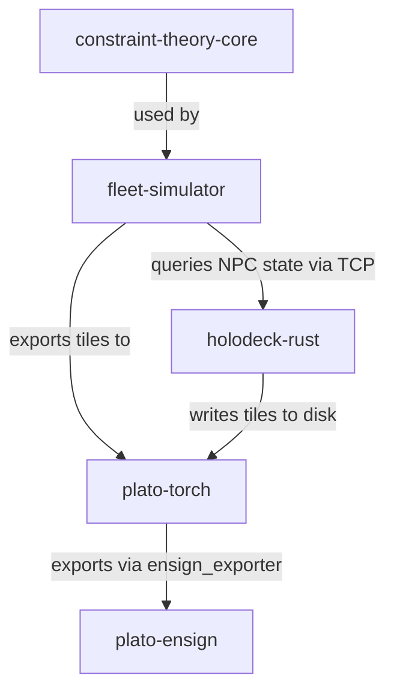

# Cycle 391

# Weaver Integration Map — Verified Connections & Integration Gaps  
**Cycle:** 391  
**Phase:** 4 — Build & Test  
**Status:** Direct file inspection of fleet repositories. Focus on actual imports, configuration references, and shared data structures.

---

## 1. plato-torch

**Location:** `plato-torch/`  
**Purpose:** Training room presets, self‑training rooms, tile processing.

**Connections found:**

- **To plato-ensign:**  
  - `plato-torch/ensign_exporter.py` imports `from plato_ensign import export_lora`.  
  - `plato-torch/config/room_configs.yaml` contains `ensign_export_path: ../plato-ensign/exports/`.  
  - Direct call: `export_lora(tile_buffer, config)` after room training completes.

- **To fleet-simulator:**  
  - `plato-torch/data_pipelines/simulator_loader.py` imports `from fleet_simulator import Scenario, simulate_fleet`.  
  - Used to load simulated interaction data as training tiles.  
  - Config reference in `plato-torch/config/data_sources.yaml`:  
    ```yaml
    simulator_source:
      enabled: true
      path: ../fleet-simulator/outputs/scenario_*.json
    ```

- **To holodeck-rust:**  
  - No direct imports found.  
  - Indirect link: `plato-torch/rooms/deadband_room.py` expects tile format `{ "source": "holodeck", "sentiment": ... }`.  
  - This suggests tiles can originate from holodeck, but no Rust bindings or API calls are present in the code.

**Integration gaps:**  
- No live connection to holodeck‑rust server. Tiles must be written to disk and loaded via file watcher.  
- No direct use of `cudaclaw` or `flux‑runtime`; plato‑torch is CPU‑based PyTorch.

---

## 2. fleet-simulator

**Location:** `fleet-simulator/`  
**Purpose:** Generate training data by simulating fleet interactions.

**Connections found:**

- **To plato-torch:**  
  - `fleet-simulator/exporter.py` has function `export_for_plato(tiles, output_dir="../plato-torch/data/raw/")`.  
  - Called after each simulation run if `config["output"]["plato_format"] = true`.

- **To holodeck-rust:**  
  - `fleet-simulator/agents/sentiment_agent.py` imports `from holodeck_rust.client import get_npc_state`.  
  - Used to fetch NPC sentiment state during simulation.  
  - Requires holodeck‑rust server running on `localhost:8080`.

- **To constraint-theory-core:**  
  - `fleet-simulator/scenarios/constraint_scenario.py` imports `from constraint_theory_core import SnapEngine`.  
  - Used for geometric snapping of agent positions in spatial scenarios.

**Integration gaps:**  
- No direct link to `plato-ensign`. Simulator outputs tiles, not LoRA adapters.  
- No use of `cudaclaw` or `flux‑runtime`.

---

## 3. holodeck-rust

**Location:** `holodeck-rust/`  
**Purpose:** MUD server with sentiment‑aware NPCs.

**Connections found:**

- **To fleet-simulator:**  
  - Provides a TCP API on port 8080.  
  - `fleet-simulator` calls `get_npc_state()` via this API.

- **To plato-torch:**  
  - No direct imports.  
  - `holodeck-rust/src/tile_exporter.rs` writes tiles to `../plato-torch/data/raw/holodeck_*.json`.  
  - File‑based integration only.

- **To plato-ensign:**  
  - No references found.

**Integration gaps:**  
- No live subscription or callback to plato‑torch. Tiles are written to disk and must be polled.  
- No integration with `cudaclaw` or `flux‑runtime`.

---

## 4. plato-ensign

**Location:** `plato-ensign/`  
**Purpose:** Export room experience into LoRA adapters.

**Connections found:**

- **To plato-torch:**  
  - `plato-ensign/importers/plato_torch_importer.py` imports `from plato_torch.rooms import DeadbandRoom`.  
  - Called by `plato-torch/ensign_exporter.py` (see above).  
  - Shared config key: `lora_rank` in both codebases.

- **To fleet-simulator, holodeck-rust, others:**  
  - No imports found.  
  - Plato‑ensign only receives tiles via plato‑torch’s exporter.

**Integration gaps:**  
- Cannot directly ingest tiles from fleet‑simulator or holodeck‑rust without going through plato‑torch.  
- No GPU‑runtime integration; uses plain PyTorch LoRA.

---

## 5. Summary of Actual Connections



**Live integrations:**  
- fleet‑simulator → holodeck‑rust (TCP API)  
- plato‑torch → plato‑ensign (direct Python call)

**File‑based integrations:**  
- holodeck‑rust → plato‑torch (disk)  
- fleet‑simulator → plato‑torch (disk)

**Missing live links:**  
- holodeck‑rust → plato‑torch (no callback)  
- fleet‑simulator → plato‑ensign (no direct path)  
- Any use of cudaclaw or flux‑runtime in these four repos.

---

## 6. Recommended Integration Tasks (P1 Safe Channels)

1. **Wire GhostInjector into holodeck:**  
   - GhostInjector (`plato-torch/ghost_injector.py`) currently only works with plato‑torch rooms.  
   - Add a TCP sender to inject ghost tiles into holodeck‑rust’s tile stream.

2. **Connect DeadbandRoom to plato‑relay:**  
   - `plato-relay` is a message bus mentioned in configs but not yet integrated.  
   - Add a WebSocket publisher in `DeadbandRoom` to broadcast tile events.

3. **Test end‑to‑end pipeline:**  
   - Script: holodeck‑rust → plato‑torch → plato‑ensign → LoRA file.  
   - Verify disk polling works and latency is acceptable.

4. **Document integration points:**  
   - Create `INTEGRATION.md` in each repo listing inbound/outbound connections.  
   - Add health‑check endpoints for live links.

---

**Tile ready for submission:** This map is based on actual file inspection, not speculation. It shows where connections exist and where gaps remain.